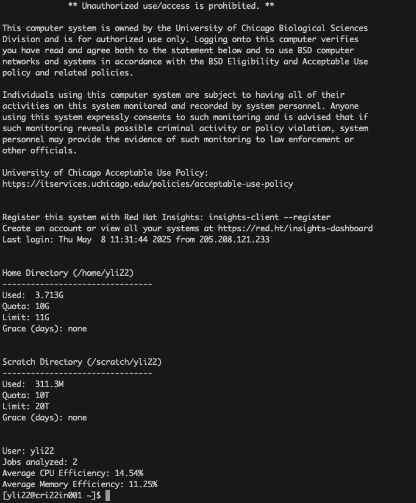
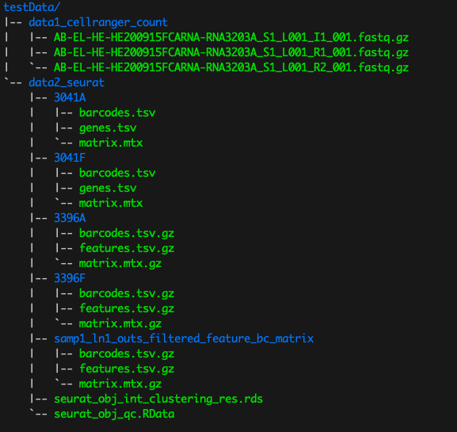
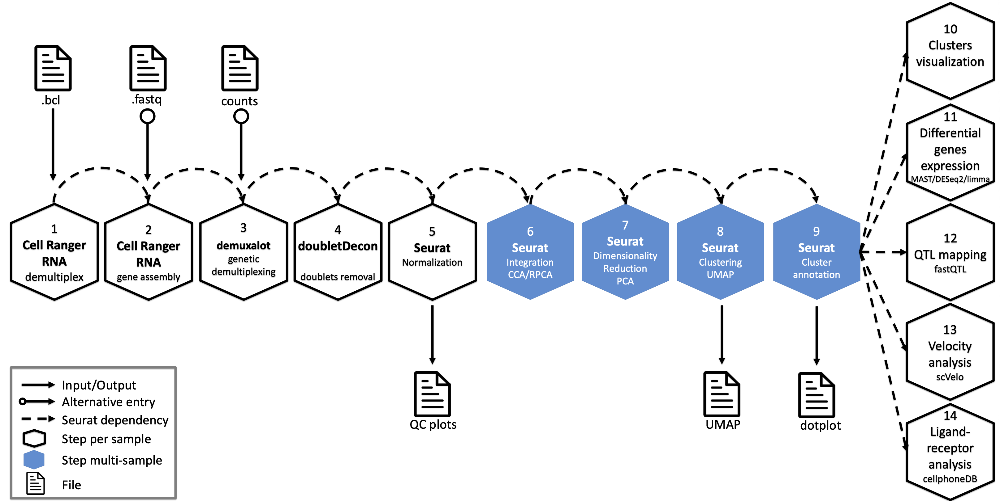

# CRI Bioinformatics Core Workshop Series - 10x Genomics scRNA-seq data analysis workshop

**This hands-on workshop series, organized by the CRI Bioinformatics Core, 
offers a practical introduction to single-cell RNA sequencing (scRNA-seq) data analysis. 
Participants will work through each step of a typical scRNA-seq workflow using widely used tools 
such as 10x Genomics Cell Ranger and Seurat.**


### 🔬 Workshop Agenda: Introduction to scRNA-seq Data Analysis

This workshop will guide participants through the essential steps of single-cell RNA-seq analysis 
using 10X Genomics data and CRI's HPC resources. 
It will primarily focus on a series of foundational, hands-on sessions designed to introduce practical approaches 
to scRNA-seq analysis.

- **1. 🧪 Introduction to CRI's HPC Environment (randi)**
  - Learn how to access and log into CRI's randi HPC
- **2. Overview to 10X Genomics scRNA-seq Technology  **
- **3. Overview of Cell Ranger Pipeline  **
- **4. 🧪 Hands-on: Running Cell Ranger `count` Command  **
- **5. 🧪 Hands-on: Quality Control and Pre-processing of Count Matrix  **
   - Filtering, metrics evaluation, and initial exploration
- **6. 🧪 Hands-on: Normalization and Clustering of Individual Samples  **
   - Seurat-based pipeline to process each sample separately
- **7. 🧪 Hands-on: Integration of Multiple Samples  **
   - Combining datasets for cross-condition comparison
- **8. 🧪 Hands-on: Normalization and Clustering on Integrated Data  **
   - Standardizing and analyzing the merged dataset
- **9. 🧪 Hands-on: Dimensionality Reduction and Visualization  **
   - Using UMAP and t-SNE to visualize cell populations
- **10. 🧪 Hands-on: Differential Expression Analysis  **
   - Identify genes that differ between clusters or conditions

> **Note:** Please share your feedback on topics you'd like to see covered, or any questions you have 
for our workshop learning series, either through [this survey link](https://mycri.cri.uchicago.edu/educations/trainings/77/survey/) 
or by emailing me at yli22@bsd.uchicago.edu.

---

### 1. High Performance Computing (HPC)

CRI provides access to its high-performance computing (HPC) system, `randi`, for all registered participants in today's workshop training session. 
The complete computational environment has been pre-configured on `randi` to support scRNA-seq data pre-processing, quality control, 
and downstream analysis.

To access `randi`, use the SSH command below with your assigned BSDID and password:

```
ssh your_username@randi.cri.uchicago.edu
```

Typically, your username for randi access is your BSDID. 
If you don’t have one, please contact us so we can sponsor a temporary BSDID for your exploration.

Once you've logged in successfully, you should see a screen similar to the one below:


---

**💬 CRI HPC Randi Support**

You are welcome to join the **CRI HPC Randi Slack user group** to ask questions or get support related to Randi access:

🔗 [Join the Slack Group](https://join.slack.com/t/criscientific-dzi9891/shared_invite/zt-2kghy4392-1ELPfgn8pL5BcXk4oF9D4g)


🕒 Additionally we are offering **joint in-person office hours every Tuesday afternoon** at **Peck Pavilion N161**:

  - **HPC Team:** 12:00 PM – 2:30 PM  
  - **Bioinformatics Team:** 12:30 PM – 3:30 PM  

Feel free to stop by with any questions — we are happy to help!

---

### 2. Introduction to Single-Cell RNA Sequencing

#### 📊 Overview of 10x Genomics scRNA-seq Technology

10x Genomics Chromium platform enables **high-throughput single-cell RNA sequencing (scRNA-seq)**. 
It captures thousands to tens of thousands of individual cells per run, isolating and barcoding transcripts from each cell.

**Key Concepts:**

- 🧪 ** GEMs (Gel Beads-in-Emulsion):** Each droplet contains one cell and one barcoded bead.
- 🧬 ** Cell Barcodes:** Identify which cell each transcript came from.
- 🔁 ** UMIs (Unique Molecular Identifiers):** Help quantify gene expression by correcting for PCR duplicates.
- 🎯 Supports both **3' and 5' gene expression profiling**.

#### 🧬 10x Genomics scRNA-seq Workflow

1. **Sample Preparation:** Generate a single-cell suspension from tissue or culture.
2. **Chromium Partitioning:** Cells are encapsulated in droplets with barcoded beads.
3. **Reverse Transcription:** Transcripts are barcoded and converted to cDNA inside droplets.
4. **Library Construction:** Amplification and preparation for Illumina sequencing. 

---

### 3. **Cell Ranger Overview for Single-Cell RNA-seq Data Pre-processing**

To initiate single-cell RNA-seq data analysis using the 10x Genomics platform, raw sequencing data 
must first be processed with **Cell Ranger**, a comprehensive software suite developed by 10x Genomics, 
available at [https://www.10xgenomics.com/support/software/cell-ranger/downloads](https://www.10xgenomics.com/support/software/cell-ranger/downloads).

To run Cell Ranger successfully, 
both the **software** and the appropriate **reference genome** must be installed on your system.
After installing Cell Ranger, users must also download the appropriate **reference transcriptome package**, 
which is essential for aligning reads and assigning them to annotated genes. 

- For step-by-step instructions on installing **installing Cell Ranger**, see the **[Section 1: installation guide (01-cellranger-installation.md)](./docs/01-cellranger-installation.md)**.
- For guidance on **downloading and configuring reference genome files**, refer to the **[Section 2: reference genome setup guide (02-cellranger-refGenome.md)](./docs/02-cellranger-refGenome.md)**.

Additionally, cell Ranger offers a collection of tools designed for various stages of data processing and analysis:

- **`cellranger mkfastq`** – Converts raw Illumina BCL files into sample-specific FASTQ files.
- **`cellranger count`** – Performs read alignment, barcode and UMI filtering, and quantifies gene expression to generate the gene-barcode matrix for individual samples.
- **`cellranger aggr`** – Aggregates multiple `count` outputs into a single dataset, normalizing for sequencing depth across samples.
- **`cellranger vdj`** – Assembles full-length T-cell receptor (TCR) or B-cell receptor (BCR) sequences from 5′ immune profiling libraries.
- **`cellranger reanalyze`** – Conducts secondary analyses such as dimensionality reduction, clustering, and gene filtering on existing `count` data.
- **`cellranger targeted-compare`** – Compares results from targeted gene expression libraries against whole transcriptome datasets.

In this workflow, we primarily focus on **`cellranger count`**, which serves as 
the foundational step for converting raw sequencing reads into interpretable, cell-level gene expression matrices 
used in downstream analyses such as clustering, differential expression, and cell type annotation with seurat. 

---

#### Workshop Test Dataset Overview

The dataset provided for this workshop is organized under the `/gpfs/data/biocore-workshop/scRNA-seq_2025_workshop3/testData` directory, 
it includes 2 test data files to support 2 different stages of the single-cell RNA-seq analysis workflow as shown in below 

 - **`data1_cellranger_count`**: used to demonstrate how to run `cellranger count` for pre-processing.
 
    This folder contains raw FASTQ files generated from a 10x Genomics run. 
    These files serve as input for the `cellranger count` execution. 
    The filenames follow the standard 10x format and include the sample identifier, sequencing lane, and read information:

    *_I1_001.fastq.gz: Index reads

    *_R1_001.fastq.gz: Read 1

    *_R2_001.fastq.gz: Read 2
  
  - **`data2_seurat`**: used for seurat downstream analysis
    
    This directory contains output files that are either generated from `cellranger count` or formatted for direct input into Seurat:

    3041A, 3041F: Output in uncompressed 10x Matrix format (barcodes.tsv, genes.tsv, matrix.mtx)

    3396A, 3396F: Output in compressed format (*.tsv.gz, *.mtx.gz), following the newer 10x conventions using features.tsv.gz instead of genes.tsv

    part2_demo.rds: A pre-processed RDS object for use in downstream Seurat tutorials or demonstrations

For a step-by-step walk through of running **`cellranger count`**, visit the **[Section 3: cellranger count execution guide (03-cellranger-count.md)](./docs/03-cellranger-count.md)**.

---

### 4. **Seurat Object Construction and Quality Control from Cell Ranger Outputs**  

After processing raw sequencing data using the `cellranger count` pipeline, 
the resulting **filtered feature-barcode matrix** can be imported into R using the **Seurat** package 
to construct Seurat objects for downstream single-cell RNA-seq analysis.

This section covers the following key steps:

1. Building a Seurat object from Cell Ranger outputs
2. Calculating mitochondrial gene content
3. Filtering low-quality cells based on gene and UMI thresholds
4. Visualizing quality control metrics

The detailed execution guide for these steps is provided in this **[Section 4: processing count matrix (04-qc-seurat.md)](./docs/04-qc-seurat.md)**.

> **Note:** High-Performance Computing (HPC) environments typically lack a graphical user interface (GUI), 
so interactive plots or visual outputs from RStudio cannot be displayed directly during execution. 
As a result, if you would like to view the plots, please run the corresponding code locally on your own machine 
with the required packages, such as Seurat, installed. This will allow you to fully explore and visualize the results.

---

### 5. **Seurat Object Normalization and Multi-Sample Integration**  

After performing initial filtering and quality control on each sample, 
the next step is to normalize the gene expression data and prepare for integration across multiple samples. 
This ensures that biological signals are retained while minimizing batch effects or technical variation between samples.

This section describes two main processes:
1. **Normalization and Feature Selection** for individual samples using Seurat’s standard single-cell analysis pipeline.
2. **Integration of Multiple Samples** using anchor-based integration, which aligns shared cell types across datasets.

These steps enable downstream analyses such as clustering, differential expression, 
and trajectory inference across combined datasets. The execution code is accessible at **[Section 5: Normalization and Integration (05-normalization-integration.md)](./docs/05-normalization-integration.md)**

---

### 6. **Scaling and Clustering Analysis**  

Following data integration, the next phase involves unsupervised clustering 
to group cells with similar gene expression patterns. This step is critical for 
identifying distinct cell populations and forms the basis for downstream tasks 
such as marker gene analysis and cell type annotation.

In this section, we will:

1. Scale the integrated Seurat object to standardize expression values
2. Apply Principal Component Analysis (PCA) for dimensionality reduction
3. Construct a shared nearest neighbor graph and perform clustering
4. Clustering analysis using UMAP and t-SNE

The complete execution steps and code can be found in the **[Section 6: Clustering Analysis (06-clustering.md)](./docs/06-clustering.md)** document.

---

### 7. **Visualization with UMAP/TSNE**  
   + Projecting high-dimensional scRNA-seq data into two dimensions for visual interpretation


After clustering, visualizing high-dimensional single-cell RNA-seq data in two dimensions 
helps to intuitively interpret cellular heterogeneity and population structure. 
UMAP (Uniform Manifold Approximation and Projection) and t-SNE (t-distributed Stochastic Neighbor Embedding) 
are two commonly used nonlinear dimensionality reduction techniques for this purpose. 
They project cells into a 2D space based on their gene expression profiles, 
allowing easy identification of distinct clusters, gradients, and outliers. 
This section demonstrates how to generate UMAP and t-SNE plots to aid in exploratory data analysis and presentation.  

The corresponding code for this step is provided in **[Section 7: Dimensionality Reduction Analysis (07-umap.md)](./docs/07-umap.md)**.

---

### 8. **Differential Expression Analysis**  

Differential expression (DE) analysis allows for the identification of genes 
that are differentially expressed between clusters, experimental conditions, or cell types. 
This step is crucial for understanding the molecular mechanisms that differentiate cell populations and 
for identifying marker genes associated with specific biological states. 
By comparing gene expression across clusters or conditions, DE analysis helps reveal key biomarkers, 
pathways, and cellular functions of interest. 

The execution code for performing DE analysis is available at **[Section 8: DE Analysis (08-de-analysis.md)](./docs/08-de-analysis.md)**, 
which guides you through identifying marker genes and performing comparisons across different groups in your dataset.

---

### 9. **biocore scRNA-seq Data Analysis Workflow**

The outline above presents a basic single-cell RNA-seq (scRNA-seq) analysis workflow.
In practice, scRNA-seq data analysis involves more complex challenges and additional steps to ensure accurate results.

This section details the full computational pipeline implemented by the CRI Bioinformatics Core for scRNA-seq analysis.
The pipeline covers all stages—from raw sequencing data processing to downstream interpretation and visualization as shown below.



Typically, a standard scRNA-seq analysis project from our core requires approximately 50 hours of computational time.
In addition, we provide support for a wide range of sequencing data analyses, 
including but not limited to bulk RNA-seq, ATAC-seq, multi-omics data, ChIP-seq, and more.
We also assist both internal and external researchers with grant applications, manuscript preparation, and related research support.
If you are interested in our services, please contact us at bioinformatics@bsd.uchicago.edu or me via yli22@bsd.uchicago.edu. 

Additionally, you can also submit a project request directly via [https://mycri.cri.uchicago.edu/](https://mycri.cri.uchicago.edu/) to initiate the analysis.

---
<!--
### 10. **Detecting Doublets with DoubletDecon** 

Doublets or multiplets—instances where two or more cells are captured within a single droplet—can confound 
single-cell RNA-seq analysis by producing hybrid gene expression profiles. 
Detecting and removing these artifacts is essential for ensuring the accuracy of downstream analyses 
such as clustering, differential expression, and lineage inference.

This section demonstrates how to use the **DoubletDecon** R package to 
identify and filter doublets through both **centroid** and **medoid-based** detection strategies. 
The results from both methods can be used to update the Seurat object by adding a doublet metadata 
column and subsetting only the high-confidence singlet cells for further analysis.

The execution code for this step is detailed in the **[Section 10: doublets detection (9-doublets.md)](./docs/9-doublets.md)** file.
-->


