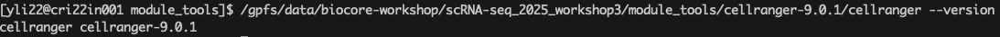

# Cell Ranger Installation Guide

This guide provides step-by-step instructions for installing the **Cell Ranger** software suite, 
developed by 10x Genomics, which is required for processing single-cell RNA-seq data.

> 💡 **Note:** The Cell Ranger environment has already been set up on the **Randi HPC**. 
Users on this system can skip installation and proceed directly to data processing on **Randi HPC**. 
Please load the module or activate the appropriate conda environment as configured on the cluster.

---

## 1. System Requirements

Before installation, ensure your system meets the following requirements:

- **Operating System**: Linux (Ubuntu 16.04+, CentOS 7+)
- **CPU**: 8 or more cores recommended
- **RAM**: At least 32 GB (higher for large datasets)
- **Disk Space**: 1 TB or more recommended
- **Python**: Comes bundled with Cell Ranger (no separate installation required)

---

## 2. Download Cell Ranger

1. Visit the official [10x Genomics Cell Ranger download page](https://www.10xgenomics.com/support/software/cell-ranger).
2. Choose the desired version, the latest version is `Cell Ranger 9.0.1 (Feb 6, 2025)`.
3. Download and extract the tarball using the following commands, please refer to the downloading website for the real downloading link:

```
wget -O cellranger-9.0.1.tar.gz "https://cf.10xgenomics.com/releases/cell-exp/cellranger-9.0.1.tar.gz?Expires=1748676745&Key-Pair-Id=APKAI7S6A5RYOXBWRPDA&Signature=Vk1OjAPXsNYQhUG1pdsmZLapQchmVTxmHd41I3G6kYDO4q6q17ePMY41MKVymO3q7IUdZywaOc0G6HeXn-h6vpWV9HFy2oU6emgs6lh1KilZVz8AGIVh3k~dEEuKERGG5z6NXuCuxNl1nJJi4Zwj5kDRnKpOmg4WZAHf7Bs9PcuBFEQOHtuZAqcw-GM3tEwy8Nt3R9pdWKi0dQuj1Q7uCGB7J9q-3Fn0-~hg6qqVSqbJ-oBE35Kq~~Kkq6~nhrcis--Jw1~FKi2m~iNHLiZrOrgGoNLkwTDXWr-VuzCH35fqyXY-m4euX~4WF6XhpesWN10jIiAreWHnEuoKERS5nA__"
tar -xzvf cellranger-9.0.1.tar.gz
```

## 3. Set Up Environment for cellRanger

After downloading and extracting Cell Ranger, you need to configure your system environment 
so the `cellranger` command is recognized in any directory.

---

### Add Cell Ranger to your `PATH` or use the full path to call cell ranger

Temporarily set the PATH in your current terminal session:

```
export PATH=$PATH:/your/path/to/cellranger-9.0.1
```

### Verify cellRanger Installation

After configuring your environment, verify that **cellRanger** is correctly installed and 
accessible from your terminal.

e.g. you can check cellranger version via running the following command:

```
cellranger --version
```

If the installation is successful, you should see output similar to:

```
cellranger 9.0.1
```

## 4. `randi HPC` installed `cell ranger`

For our `Randi HPC`, the cell ranger path has been integrated into the path `/gpfs/data/biocore-workshop/scRNA-seq_2025_workshop3/module_tools/cellranger-9.0.1/`. 

You can access this configured cell ranger by calling it via full path using the following command:

```
/gpfs/data/biocore-workshop/scRNA-seq_2025_workshop3/module_tools/cellranger-9.0.1/cellranger --version
```

Then you should see a screen similar to the one below:

