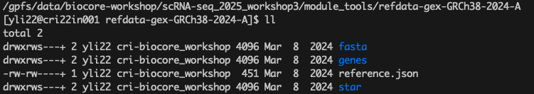

## Section 2: Cell Ranger Reference Genome Installation Guide

To enable read alignment and quantification, `cellranger` requires an appropriate reference genome file 
to run `cell ranger` for `count` / `multi`. 

10x Genomics provides pre-built reference packages for common species including human and mouse.

> **Note:** For multiome analysis using `cellranger-arc`, 
a different reference package is required. That installation is not covered in this document.

---

### 📦 1 Huamn Reference Genome

The current human genome reference version recommended for use with `cellranger` is:

- **Human reference (GRCh38) – 2024-A**

#### 🔽 1.1 Download

Run the following command to download the reference package:

```bash
wget "https://cf.10xgenomics.com/supp/cell-exp/refdata-gex-GRCh38-2024-A.tar.gz"
```

#### 📂 1.2 Extract

After downloading, extract the contents:

```bash
tar -xzvf refdata-gex-GRCh38-2024-A.tar.gz
```

You will then have a directory (e.g., `refdata-gex-GRCh38-2024-A`) containing the pre-built genome index and gene annotation. 
This directory can be passed to `cellranger` commands using the `--transcriptome` option.

---

### 2. Mouse Reference Genome

The current mouse genome reference version recommended for use with `cellranger` is:

- **Mouse reference (GRCm38) – 2024-A**

#### 🔽 2.1 Download

Run the following command to download the reference package:

```bash
wget "https://cf.10xgenomics.com/supp/cell-exp/refdata-gex-GRCm39-2024-A.tar.gz"
```

#### 📂 2.2 Extract

After downloading, extract the contents:

```bash
tar -xzvf refdata-gex-GRCm39-2024-A.tar.gz
```

As with the human reference, you will have a directory (e.g., `refdata-gex-GRCm39-2024-A`) that can be used in 
`cellranger count` or `cellranger multi`.

---

✅ After downloading and extracting the reference files, you are ready to proceed with data processing using `cellranger`.

➡️ For step-by-step instructions on running `cellranger count`, refer to the next section [03-cellranger-count.md](./03-cellranger-count.md).

---
### 3 `randi HPC` installed cell ranger human reference genome

In this tutorial, all test data come from **human samples**, only the human reference genome is installed on `randi`, 
it is accessible at `/gpfs/data/biocore-workshop/scRNA-seq_2025_workshop3/module_tools/refdata-gex-GRCh38-2024-A` 
as shown in .

---