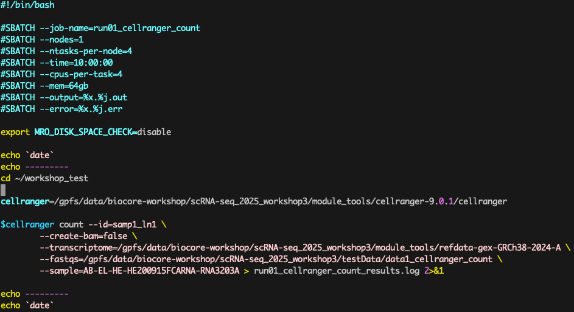
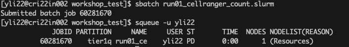
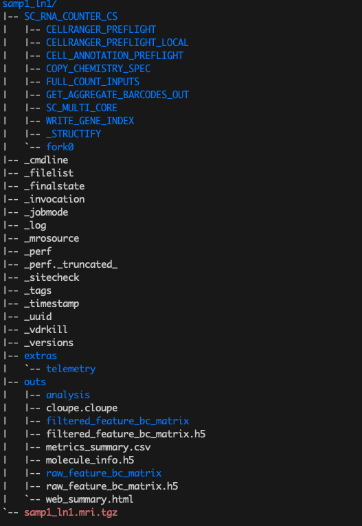

## Section 3: **`cellranger count`** execution guide

This pipeline aligns sequencing reads from FASTQ files to a specified reference transcriptome. 
It produces a .cloupe file for visualization and analysis in the 10x Genomics Loupe Browser. 
Additionally, it generates various other outputs that are compatible with other publicly available tools,
some of which will be explored in later sections of this workshop.

The execution code is located at `/gpfs/data/biocore-workshop/scRNA-seq_2025_workshop3/run01_cellranger_count.slurm`, 
and you can copy it to your home directory or own created directory for execution. 

---

### 1. Copy and Edit the SLURM File to Workshop Lab-share Directory

Please be aware of your own execution directory and edit the corresponding directory in the slurm code 
before submitting the job for execution.

```bash
cd ~
mkdir workshop_test
cd workshop_test/
cp /gpfs/data/biocore-workshop/scRNA-seq_2025_workshop3/run01_cellranger_count.slurm ./
```

`testData1_count.slurm` is the SLURM file to be executed on Randi via `sbatch`. 
Depending on your operating system, you can use different tools to check and edit this file. 
One way to do so is via the `vi` or `vim` command to check and edit this file. For example, to open the file in `vim`, run:

```bash
vim testData1_count.slurm
```

The slurm contents are seen as below


If you run `vim`, then press 'Esc' and type `:q!` to exit this file.

When you open this file, as shown in the presentation slide, 
the code is executed under the created directory at `~/workshop_test`. 
Therefore, all analysis results and execution log files will be saved under this directory.

### 2. Explanation of Options

- `--id=sampl1_ln1`: This specifies the output directory for the results. The directory will be named as `sampl1_ln1`.
- `--transcriptome=/path/to/refdata`: Specifies the path to the reference transcriptome to use. 
In this case, it's pointing to the human reference genome version GRCh38-2024-A located at `/gpfs/data/biocore-workshop/scRNA-seq_2025_workshop3/module_tools/refdata-gex-GRCh38-2024-A`.
- `--fastqs=/path/to/fastq_files`: Specifies the directory where the FASTQ files are located. These files contain the raw sequencing reads.
In our example, the test data for this execution is saved under directory `/gpfs/data/biocore-workshop/scRNA-seq_2025_workshop3/testData/data1_cellranger_count`
- `--sample=sample_name`: Indicates the specific sample(s) to process if more than one samples are available. 
In this case, it will process the sample name strating with prefix `AB-EL-HE-HE200915FCARNA-RNA3203A`.
- `> testdata1_count.log 2>&1`: Redirects the output and errors to a log file (`testdata1_count.log`) for tracking and debugging.

> **Note**: There are many more options you can use with `cellranger count`. To explore all available options, run the following command:

```bash
/gpfs/data/biocore-workshop/scRNA-seq_2025_workshop3/module_tools/cellranger-9.0.1/cellranger count --help
```

### 3. Submiting Job for Execution

Now, you can submit this SLURM job on `Randi` for Execution with the following command:

```bash
sbatch testData1_count.slurm
```

##### Check Submitted Jobs

On Randi, you can check your submitted jobs with the following command:

```bash
squeue -u your_username
##for me it is
squeue -u yli22
```

Then you can see the window as below:


The processing of this dataset will take approximately 20 minutes to complete. 
Once the execution finishes, a results directory named `sampl1_ln1` will be created under the working directory `~/workshop_test`.

The structure of the results directory is illustrated below:



Within the `outs` subdirectory, the generated count matrix will be used for downstream analysis, such as with Seurat. 
You may choose to use either the **filtered count matrix** located in `filtered_feature_bc_matrix/` or 
the **unfiltered version** in `raw_feature_bc_matrix/`, depending on your analysis requirements.

