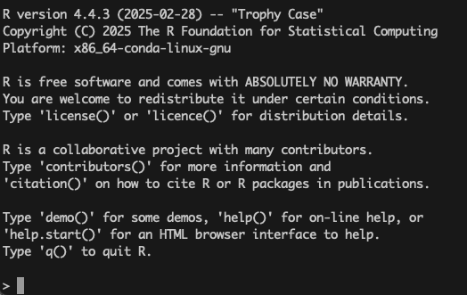
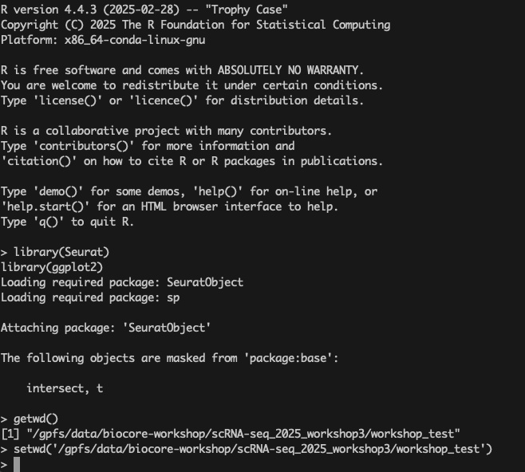
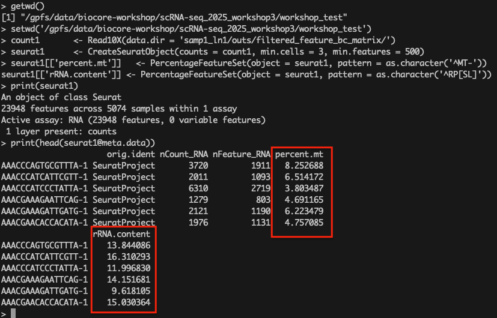
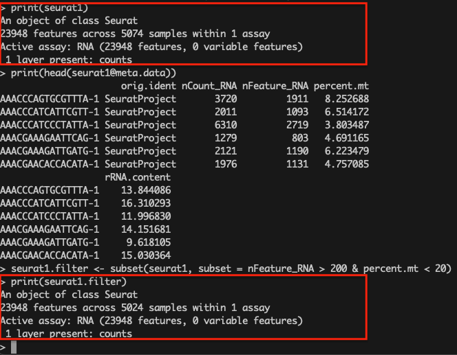
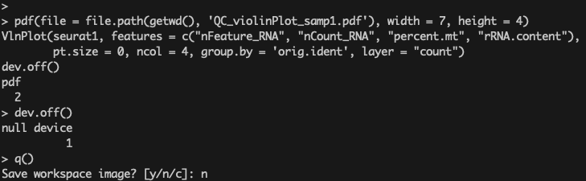
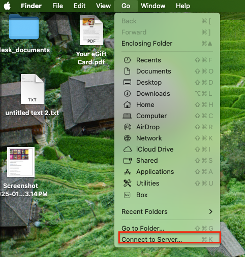
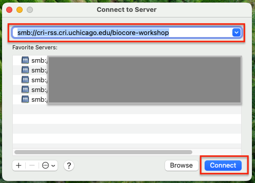
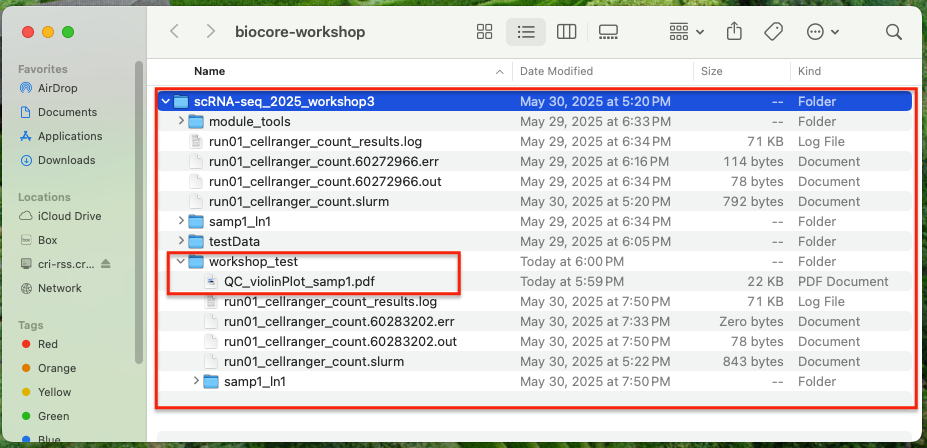
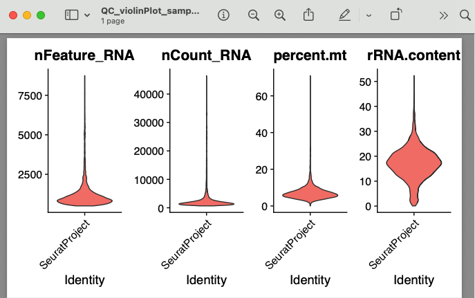

# 04 - QC with Seurat

This document outlines the basic steps to construct a Seurat object from 10x Genomics data 
and perform quality control filtering based on mitochondrial content and gene/UMI thresholds.

## Step 1: Accessing the Pre-installed R Environment on randi HPC

To launch the pre-installed R environment with the required packages on `randi`, use the following command:

```bash
/gpfs/data/biocore-workshop/scRNA-seq_2025_workshop3/module_tools/workshop3_env/bin/R
```
After executing this command, you should see an R session start with output similar to the example below:



Once the R session has started, load the required computational packages using the commands below:

```r
library(Seurat)
library(ggplot2)
```

Next, verify your current working directory with command `getwd()`. 
If it is not set appropriately, use the following commands to change it to the appropriate location:

```r
getwd()
setwd('/gpfs/data/biocore-workshop/scRNA-seq_2025_workshop3/workshop_test')
```



## Step 1: Set Up Seurat Object

```r
## read into R environment the cellranger count analysis results
count1       <- Read10X(data.dir = 'samp1_ln1/outs/filtered_feature_bc_matrix/')
## create seurat object by filtering out low expression cells
seurat1      <- CreateSeuratObject(counts = count1, min.cells = 3, min.features = 500)
```

## Step 2: Calculate Mitochondrial and rRNA Content

```r
seurat1[['percent.mt']]   <- PercentageFeatureSet(object = seurat1, pattern = as.character('^MT-'))
seurat1[['rRNA.content']] <- PercentageFeatureSet(object = seurat1, pattern = as.character('^RP[SL]'))
```

Review your Seurat quality control (QC) results by printing the entire Seurat object and inspecting the metadata slot with the commands below:

```r
print(seurat1)
print(head(seurat1@meta.data))  # Equivalent to print(head(seurat1))
```

You should then see output similar to the following from the computation.




## Step 3: Filter Cells Based on QC Metrics

```r
seurat1.filter <- subset(seurat1, subset = nFeature_RNA > 200 & percent.mt < 20)
```

These steps help ensure the dataset includes high-quality cells suitable for downstream analysis. 
You can see that low-quality cells have been removed by inspecting the filtered Seurat object `seurat1.filter`.




## Step 4: Visualize QC Metrics with Violin Plots

Use the following code to create violin plots for key metadata metrics:

```r
pdf(file = file.path(getwd(), 'QC_violinPlot_samp1.pdf'), width = 7, height = 4)
VlnPlot(seurat1, features = c("nFeature_RNA", "nCount_RNA", "percent.mt", "rRNA.content"), 
        pt.size = 0, ncol = 4, group.by = 'orig.ident', layer = "count")
dev.off()
```

This visualization provides an overview of feature distributions across cells and helps identify potential outliers. 
As previously noted, High-Performance Computing (HPC) environments typically do not support graphical user interfaces (GUIs). 
Therefore, the QC plot is saved to a file named `QC_violinPlot_samp1.pdf` in the current working directory using the `pdf()` function shown as above.

> **Note:** If you are running the analysis in RStudio (or any local GUI-supported environment), 
you can view the plot interactively and do not need to use the `pdf()` function. Simply running the `VlnPlot()` command will 
display the plot in the Plots panel.

You can now exit the R environment on the HPC via command `q()`. 



To visualize the above saved plot, Mac users can use the `Go > Connect` to Server function to access the `lab-share` server.







> **Note:** Windows and Linux users should use their respective methods to connect 
to the lab-share directory and review the output files.

You should now see the QC plot as shown below:




