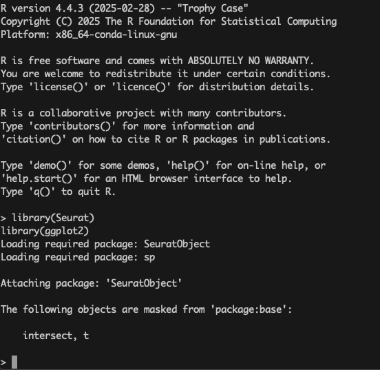

# 04 - QC with Seurat

This document outlines the basic steps to construct a Seurat object from 10x Genomics data 
and perform quality control filtering based on mitochondrial content and gene/UMI thresholds.

## Step 1: Accessing the Pre-installed R Environment on randi HPC

To launch the pre-installed R environment with the required packages on `randi`, use the following command:

```bash
/gpfs/data/biocore-workshop/scRNA-seq_2025_workshop3/module_tools/workshop3_env/bin/R
```
After executing this command, you should see an R session start with output similar to the example below:


Once the R session has started, load the required computational packages using the commands below:

```r
library(Seurat)
library(ggplot2)
```



## Step 1: Set Up Seurat Object

```r
count1       <- Read10X(data.dir = '3041A/')
seuratOrg    <- CreateSeuratObject(counts = count1)
seurat1      <- CreateSeuratObject(counts = count1, min.cells = 3, min.features = 500)
```

## Step 2: Calculate Mitochondrial and rRNA Content

```r
seurat1[['percent.mt']]   <- PercentageFeatureSet(object = seurat1, pattern = as.character('^MT-'))
seurat1[['rRNA.content']] <- PercentageFeatureSet(object = seurat1, pattern = as.character('^RP[SL]'))
print(head(seurat1@meta.data))  # Equivalent to print(head(seurat1))
```

## Step 3: Filter Cells Based on QC Metrics

```r
seurat1.filter <- subset(seurat1, subset = nFeature_RNA > 200 & percent.mt < 20)
```

These steps help ensure the dataset includes high-quality cells suitable for downstream analysis.

## Step 4: Visualize QC Metrics with Violin Plots

Use the following code to create violin plots for key metadata metrics:

```r
VlnPlot(seurat1, features = c("nFeature_RNA", "nCount_RNA", "percent.mt", "rRNA.content"), 
        pt.size = 0, ncol = 4, group.by = 'orig.ident')
```

This visualization helps assess the distribution of features across cells and detect potential outliers.
