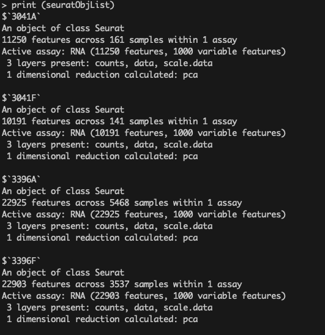
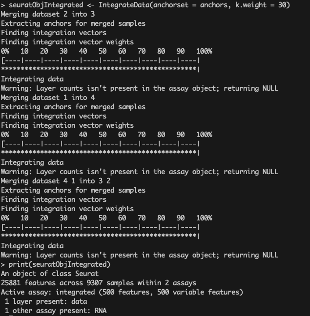

# Section 5: Individual Sample Normalization, Clustering, and Subsequent Multi-sample Integration

If you have closed the previous R console session on the RANDI HPC, you can reopen it using the command below.

```bash
cd /gpfs/data/biocore-workshop/scRNA-seq_2025_workshop3/workshop_test
/gpfs/data/biocore-workshop/scRNA-seq_2025_workshop3/module_tools/workshop3_env/bin/R
```

I have saved the previously computed Seurat object in `.RData` format. 
You can load it using the command below before proceeding with further analysis.

```r
library(Seurat)
library(ggplot2)
load('/gpfs/data/biocore-workshop/scRNA-seq_2025_workshop3/testData/data2_seurat/seurat_obj_qc.RData')
```

---

## Step 1: Normalize and preprocess for individual sample

```r
seuratObj = seurat1.filter
seuratObj <- NormalizeData(seuratObj, normalization.method = "LogNormalize", scale.factor = 10000)
seuratObj <- FindVariableFeatures(seuratObj, selection.method = 'vst', nfeatures = 1000)
seuratObj <- ScaleData(object = seuratObj)
seuratObj <- RunPCA(object = seuratObj)
seuratObj <- FindNeighbors(seuratObj, reduction = "pca", dims = 1:20)
seuratObj <- FindClusters(seuratObj, resolution = 0.5)
```

With these steps, the entire analysis workflow, illustrated below, has been completed.


---

## Step 2: Normalize and preprocess for multiple samples

> Repeat the analysis steps above for each sample and store the resulting objects 
in a list named `seuratObjList` for downstream multi-sample integration.

```r
## Step1: save all samples pre-processing results into a list object
## setup empty list object to save sample's pre-processing results
seuratObjList <- list()

inputPath<- list('3041A'='/gpfs/data/biocore-workshop/scRNA-seq_2025_workshop3/testData/data2_seurat/3041A/', 
'3041F'='/gpfs/data/biocore-workshop/scRNA-seq_2025_workshop3/testData/data2_seurat/3041F/', 
'3396A'='/gpfs/data/biocore-workshop/scRNA-seq_2025_workshop3/testData/data2_seurat/3396A/', 
'3396F'='/gpfs/data/biocore-workshop/scRNA-seq_2025_workshop3/testData/data2_seurat/3396F/')

for (i in 1:4) {
## Step1: setup seurat object
count1 <- Read10X(data.dir = inputPath[[i]])
seuratOrg <- CreateSeuratObject(counts = count1)
seurat <- CreateSeuratObject(counts = count1, min.cells = 3, min.features = 500)
seurat <- AddMetaData(object = seurat, col.name = 'expCond1', metadata = gsub('A|F', '', names(inputPath)[[i]]) )
seurat <- AddMetaData(object = seurat, col.name = 'expCond2', metadata = gsub('3041|3396', '', names(inputPath)[[i]]) )
## Step2: calculate MT content
seurat[['percent.mt']] <- PercentageFeatureSet(object = seurat, pattern = as.character('^MT-') )
seurat[['rRNA.content']] <- PercentageFeatureSet(object = seurat, pattern = as.character('^RP[SL]') )
## Step3: filter out MT
seurat.filter <- subset(seurat, subset = nFeature_RNA > 200 & percent.mt < 20)
## Step4: Normalization with standard analysis workflow, followed with clustering analysis
seuratObj = seurat.filter
seuratObj <- NormalizeData(seuratObj, normalization.method = "LogNormalize", scale.factor = 10000)
seuratObj <- FindVariableFeatures(seuratObj, selection.method = 'vst', nfeatures = 1000)
seuratObj <- ScaleData(object = seuratObj)
seuratObj <- RunPCA(object = seuratObj)
seuratObjList[[i]] = seuratObj
}

names(seuratObjList) = names(inputPath)
```

You can inspect the contents of this list by printing it with the following command:

```r
print (seuratObjList)
```

The output should look similar to the example below:



---

## Step 3: Multi-samples integration

The integration step can be performed in two different ways, as demonstrated below.
In `Method1`, you explicitly specify the integration features derived from `seuratObjList`, 
typically using the top 500 highly expressed genes.
In contrast, the alternative method incorporates feature selection directly through the `anchor.features` parameter.
In this example, we use RPCA as the dimensional reduction method, though other options are also available.

```r
## Take about 2-3 mins for this step
## Method1: select integration feature
features <- SelectIntegrationFeatures(object.list = seuratObjList, nfeatures = 500)
anchors  <- FindIntegrationAnchors(object.list = seuratObjList,
                                   anchor.features = features,
                                   reduction = 'rpca')
```

### Alternative:

```r
## Method2: alternative execution way
anchors <- FindIntegrationAnchors(object.list = seuratObjList, 
                                  anchor.features = 500, 
                                  reduction = 'rpca' )
```

---

## Step 4: Integrate datasets using the precomputed anchor set

```r
seuratObjIntegrated <- IntegrateData(anchorset = anchors, k.weight = 30)
print(seuratObjIntegrated)
```

The resulting integrated object is displayed below:



```r
seuratObjIntegrated$expCond3 = paste(seuratObjIntegrated$expCond1,
                                     seuratObjIntegrated$expCond2,
                                     sep = '_')

print(table(seuratObjIntegrated$expCond3))
print(table(seuratObjIntegrated$expCond2))
print(table(seuratObjIntegrated$expCond1))
```

> Similarly to the analysis performed on individual samples above, 
the integrated object can now be used for downstream clustering, visualization, and further analyses as shown in the next section (section 6).

---
