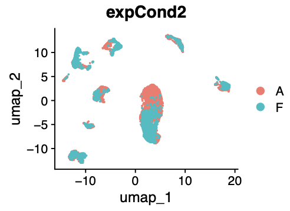

# Section 7: Clustering Results Visualizations with UMAP/TSNE

This section provides code to visualize integrated and clustered single-cell data using UMAP and t-SNE, 
along with violin plots for metadata-based quality control.

> **Note:** If you previously closed your R console session on the RANDI HPC, you can reopen it using the command below. 
The results from the earlier integrated analysis were saved in .rds format, allowing you to reload them into R 
and continue from where you left off with the command below.

```bash
cd /gpfs/data/biocore-workshop/scRNA-seq_2025_workshop3/workshop_test
/gpfs/data/biocore-workshop/scRNA-seq_2025_workshop3/module_tools/workshop3_env/bin/R
```

```r
library(Seurat)
library(ggplot2)
seuratObj.int <- readRDS('/gpfs/data/biocore-workshop/scRNA-seq_2025_workshop3/testData/data2_seurat/seurat_obj_int_clustering_res.rds')
```
---

### Dimensionality Reduction Plots

#### UMAP/tSNE plot of integrated results

```r
# UMAP and t-SNE plots to visualize clusters
pdf(file = file.path(getwd(), 'integratedSamp_umap.pdf'), width = 4, height = 4)
DimPlot(seuratObj.int, reduction = "umap")
dev.off()
```

UMAP output should be something like this:


```r
pdf(file = file.path(getwd(), 'integratedSamp_tsne.pdf'), width = 4, height = 4)
DimPlot(seuratObj.int, reduction = "tsne")
dev.off()
```

---

tSNE output should be something like this:


#### UMAP/t-SNE plots of the integrated results, split by sample groups

**You can view the group information using the `table()` function **

```r
table(seuratObj.int$expCond1)
table(seuratObj.int$expCond2)
table(seuratObj.int$expCond3)
```

Output is something like this:


---

**UMAP plots displaying the integrated data separated by sample groups. **

```r
# Split view by experimental condition
pdf(file = file.path(getwd(), 'integratedSamp_umap_sampSep.pdf'), width = 7, height = 3)
DimPlot(seuratObj.int, reduction = "umap", split.by = 'expCond2')
dev.off()
```

```r
# Gropu view by experimental condition
pdf(file = file.path(getwd(), 'integratedSamp_umap_sampSep3.pdf'), width = 4, height = 3)
DimPlot(seuratObj.int, reduction = "umap", group.by = 'expCond2')
dev.off()
```

The difference between group and split view by sample groups are shown below:

**split view**


**group view**



---

#### Combine split and group view

```r
pdf(file = file.path(getwd(), 'integratedSamp_umap_sampSep2.pdf'), width = 7, height = 3)
DimPlot(seuratObj.int, reduction = "umap", group.by = 'expCond3', split.by = 'expCond1')
dev.off()
```


---

<!--
## Violin Plots on Metadata Information

```r
# Violin plots for general QC metrics
VlnPlot(seuratObj.int, features = c("nFeature_RNA", "nCount_RNA", "percent.mt", "rRNA.content"), 
        pt.size = 0, ncol = 4, group.by = 'orig.ident')
```

```r
# Violin plots grouped by experimental condition
VlnPlot(seuratObj.int, features = c("nFeature_RNA", "nCount_RNA", "percent.mt", "rRNA.content"), 
        pt.size = 0, ncol = 4, group.by = 'expCond3')

```
-->