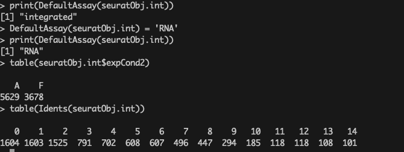

# Section 8: Differential Expression Analysis

Differential expression (DE) analysis identifies genes that are differentially expressed across different conditions, 
clusters, or populations. This section walks through the process of performing DE analysis using Seurat built-in functions.

#### Methods Used:
1. **`FindMarkers()`**: Identifies differentially expressed genes between two groups (e.g., clusters or conditions).
2. **`FindConservedMarkers()`**: Identifies markers that are conserved across conditions or groups.
3. **`FindAllMarkers()`**: Identifies markers for all clusters.

This allows the identification of genes that are significant in distinguishing between groups, 
and visualizations like feature plots, dot plots, and heatmaps can be used to interpret the results.

> **Note:** As mentioned before, if you previously closed your R console session on the RANDI HPC, 
you can reopen it using the command below. 
The results from the earlier integrated analysis were saved in .rds format, allowing you to reload them into R 
and continue from where you left off with the command below.

```bash
cd /gpfs/data/biocore-workshop/scRNA-seq_2025_workshop3/workshop_test
/gpfs/data/biocore-workshop/scRNA-seq_2025_workshop3/module_tools/workshop3_env/bin/R
```

```r
library(Seurat)
library(ggplot2)
seuratObj.int <- readRDS('/gpfs/data/biocore-workshop/scRNA-seq_2025_workshop3/testData/data2_seurat/seurat_obj_int_clustering_res.rds')
```

---

### 1. **`FindMarkers()`** 

This function is used to compare two groups (e.g., conditions or clusters) and 
identify differentially expressed genes using statistical tests. Here, we use MAST as the testing method.

```r
print(DefaultAssay(seuratObj.int))  ## Check the current assay being used
DefaultAssay(seuratObj.int) = 'RNA'  ## Set the assay to RNA
table(seuratObj.int$expCond2)  ## Check distribution of condition labels
table(Idents(seuratObj.int)) ## check the identified seurat clusters
```

Above commands are used to check the seurat object, and direct into the appropriate slots for the downstream analysis. 
The output of above commands can be see as below:



> **Note:** Since we are using Seurat v5, we need to run `JoinLayers()` to update the layers slot in the Seurat object 
before executing FindMarkers().

```r
seuratObj.int <- JoinLayers(seuratObj.int)
## 1: FindMarkers(): DE genes identification
deRes1 <- FindMarkers(subset(seuratObj.int, idents = c('4')), 
                      ident.1 = 'A', ident.2 = 'F', group.by = 'expCond2', 
                      test.use = 'MAST', 
                      min.cells.group = 3,  # Define test cells
                      logfc.threshold = 0.25, min.pct = 0.1)  # Define test genes
# Display the DE results for condition 'A' vs 'F'
print(head(deRes1))
```

You can see the differential expression analysis results as shown below:


---

### 2. **`FindConservedMarkers()`** Execution

This function is used to find genes that are consistently expressed across multiple conditions or groups. 
This helps identify conserved markers that are robust across different experimental settings.

```r
## 3.2 FindConservedMarkers(): Finds markers that are conserved between the groups
deRes2 <- FindConservedMarkers(seuratObj.int, 
                               ident.1 = '4', grouping.var = 'expCond2', 
                               min.cells.group = 3)  # Set minimum cells per group
# Print the top conserved markers
print(head(deRes2))
```

After execution, you can see the differential expression analysis results as shown below:


---

### 3. **`FindAllMarkers()`** Execution

This function is used to identify the most significant markers for all clusters in the dataset. 
This is useful for annotating and understanding the identity of each cluster.

> **Note:** This data has a total of 16 clusters, it will take miniutes to run over all clusters.

```r
## 3.3 FindAllMarkers(): Identify highly expressed cluster marker genes
deRes3 <- FindAllMarkers(seuratObj.int, 
                         assay = 'integrated', slot = "data", 
                         only.pos = TRUE,  # Only positive markers
                         test.use = 'MAST', 
                         min.cells.group = 3, 
                         logfc.threshold = 0.25, min.pct = 0.1)  # Define test genes
# Print the top markers for each cluster
print(head(deRes3))
```

After execution, you can see the differential expression analysis results as shown below:


---

### 4. DE Analysis Results Visualization
 

By identifying DE genes and visualizing their expression, 
we can gain insights into cell-type-specific functions, biological pathways,
and experimental conditions affecting gene expression.

Usually, we can use `FeaturePlot()`, `DotPlot()` and `DoHeatmap()` functions to visualize identified DEGs across different conditions as below:


##### 4.1: `FeaturePlot()` Visulization

Visualizes the expression of specific genes, such as CFD, IGKC, and SLCO2A1 (identified from `FindMarkers()`), on UMAP plots, 
allowing you to observe their distribution across the dataset, as illustrated below:


> **Note:** In this example, we are visualizing only Seurat cluster 4 by specifying the cells parameter. 
To display all cells instead, simply omit the cells argument.

```r
## Feature plot 
pdf(file = file.path(getwd(), 'DE_res_featurePlot_check1.pdf'), width = 6, height = 9)
FeaturePlot(seuratObj.int, features = c("CFD", "IGKC", "SLCO2A1"), 
            cells = WhichCells(seuratObj.int, idents = "4"),
            split.by = "expCond2", max.cutoff = 3, cols = c("grey","red"), reduction = "umap")
dev.off()
```

The resulting visualization in the PDF plot should appear as shown below:


##### 4.2: `DotPlot()` Visulization

Displays the expression of the top markers across clusters, 
helping to visualize the relative expression of genes within different cell populations.

> **Note:** The **deRes3** object was generated using `FindAllMarkers()` to identify over-expressed genes from the **integrated** assay. 
Accordingly, the subsequent visualizations should also be performed using this assay.

```r
library(dplyr)
markers.to.plot <- deRes3 %>% 
  group_by(cluster) %>% 
  arrange(desc(avg_log2FC), .by_group = TRUE) %>% 
  slice(1:3) %>% 
  pull(gene)

# Create a DotPlot using the top markers
DefaultAssay(seuratObj.int) = 'integrated'

pdf(file = file.path(getwd(), 'DE_res3_dotPlot.pdf'), width = 12, height = 6)
DotPlot(seuratObj.int, features = unique(markers.to.plot)) + RotatedAxis()
dev.off()
```

The resulting visualization in the PDF plot should appear as shown below:


##### 4.3: `Heatmap()` Visulization

Another way to visualize thoese identified over-expressed gene. It shows the expression patterns of the top markers across all cells in the dataset, 
providing a more detailed view of gene expression variations across conditions or clusters.


```r
## Heatmap of the top markers
pdf(file = file.path(getwd(), 'DE_res3_heatMap.pdf'), width = 12, height = 6)
DoHeatmap(seuratObj.int, assay = 'integrated', slot = "scale.data", features = markers.to.plot)
dev.off()
```

The resulting visualization in the PDF plot should appear as shown below:


